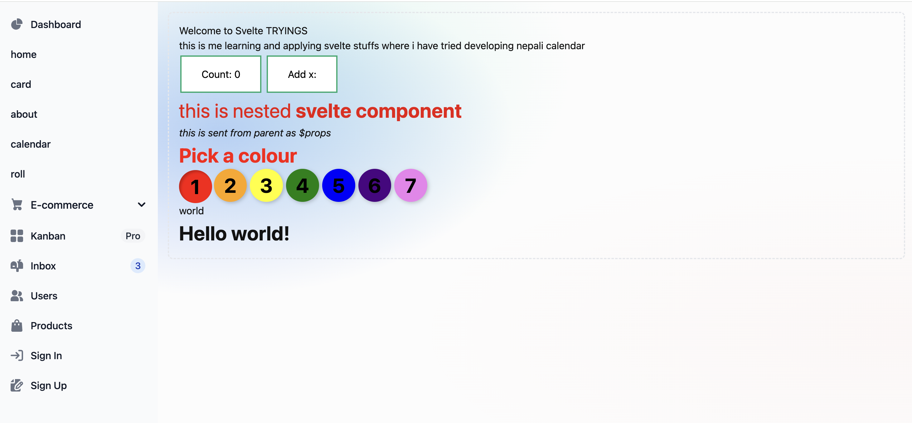

# sv

This project was created by using [`sv`](https://github.com/sveltejs/cli).

```bash
# create a new project in the current directory
npx sv create --type ts
```

# About this project
This is a project created for learning [`Svelte`](https://svelte.dev/tutorial/svelte/welcome-to-svelte).

## Tryings
I have tried to create calendar with Svelte.


All the rest are just experiments.

